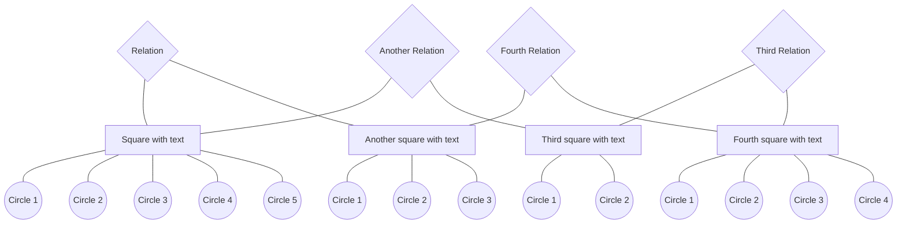

```mermaid
graph TD;
    A[Square with text];
    A1((Circle 1));
    A2((Circle 2));
    A3((Circle 3));
    A4((Circle 4));
    A5((Circle 5));
    A --- A1;
    A --- A2;
    A --- A3;
    A --- A4;
    A --- A5;
    B[Another square with text];
    B1((Circle 1));
    B2((Circle 2));
    B3((Circle 3));
    B --- B1;
    B --- B2;
    B --- B3;
    C[Third square with text];
    C1((Circle 1));
    C2((Circle 2));
    C --- C1;
    C --- C2;
    D[Fourth square with text];
    D1((Circle 1));
    D2((Circle 2));
    D3((Circle 3));
    D4((Circle 4));
    D --- D1;
    D --- D2;
    D --- D3;
    D --- D4;
    R1{Relation};
    R2{Another Relation};
    R3{Third Relation};
    R4{Fourth Relation};
    R1 --- A;
    R1 --- B;
    R2 --- A;
    R2 --- C;
    R3 --- C;
    R3 --- D;
    R4 --- B;
    R4 --- D;
```
